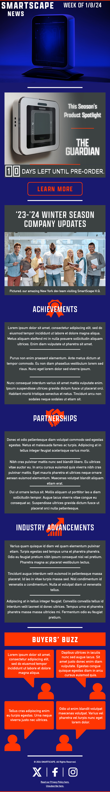

<h1 style="font-size: 20px">SMARTSCAPE - <i>Smart Home Technology Company's Subscriber Email Newsletter</i> - 2024</h1>
<h2 style="font-size: 18px">PROJECT OVERVIEW</h2>
The following is an email newsletter design concept, made for a fictional smart home software company named SmartScape. I designed it based on a randomized design prompt generated through ChatGPT. The prompt was structured as an email from SmartScape, requesting an email newsletter for their subscribers. The request specified the client's wants and needs, such as the written content and visual branding guidelines. I created the prototype in Adobe InDesign using inspiration from real B-to-C newsletters I've received and designs found being praised online in digital marketing blogs. For the more intricately-shaped elements, I made and imported them from Adobe Illustrator. I did not start the design process out from a time-saving template, since I wanted to get more out of the experience and demonstrate more of my own work for those visiting my portfolio.
<h2 style="font-size: 18px">HIGHLIGHTS OF CLIENT'S REQUEST</h2>
Create an engaging and visually stunning email newsletter for SmartScape Innovations, a leading company in the home automation industry. The newsletter aims to introduce customers to the latest innovations in smart home technology while adhering to the following design preferences:
  
<ul>
  <li><b>Color Palette:</b>
    <ul>
      <li>Primary Colors: Midnight Blue, Charcoal Gray</li>
      <li>Accent Colors: Electric Orange, White​​​​​​​</li>
    </ul>
  </li>
  <li><b>Hero Section:</b> Incorporate a captivating hero banner featuring the SmartScape Home Hub against a backdrop of Midnight Blue and Charcoal Gray. Use high-quality images with a   subtle overlay to create depth and sophistication.
  </li>
  <li><b>Product Spotlight:</b> Utilize a sleek, modular layout with a dominant use of Midnight Blue and Charcoal Gray as the background. Employ Electric Orange as the accent color for   promotional elements, such as discounts and call-to-action buttons. Ensure the product images align with the overall clean and modern aesthetic.
  </li>
  <li><b>Customer Testimonials:</b> Integrate testimonials within rounded quote boxes with Electric Orange backgrounds. Use customer images with a soft filter to maintain a consistent    and friendly appearance.
  </li>
  <li><b>Upcoming Events or Promotions:</b> Design event banners using a combination of Midnight Blue, Charcoal Gray, and Electric Orange with contrasting text. Integrate countdown       timers for promotions using a bold and easily readable font.
  </li>
  <li><b>Company Updates:</b> Use a structured grid layout with alternating Midnight Blue, Charcoal Gray, and White sections for company updates. Employ iconography representing          achievements, partnerships, or industry advancements.
  </li>
  <li><b>Social Media Integration:</b> Integrate social media buttons in a clean, minimalist style using the primary and accent colors.
  </li>
  <li><b>Responsive Design:</b> Ensure a seamless transition between desktop and mobile by optimizing the layout for different screen sizes. Prioritize clear and concise typography for   readability across devices.
  </li>
</ul>
The overall objective is to create a newsletter that not only informs customers about SmartScape's innovations but also resonates with the brand's modern, sophisticated, and user-friendly identity. Maintain consistency in the use of colors, fonts, and imagery to reinforce the SmartScape brand throughout the newsletter.
<h2 style="font-size: 18px">END RESULTS</h2>

